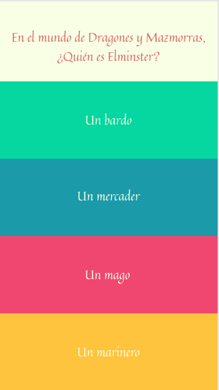
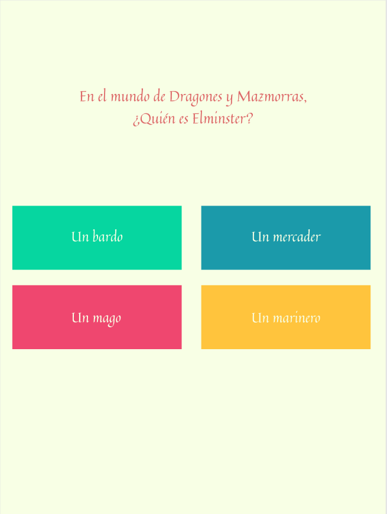
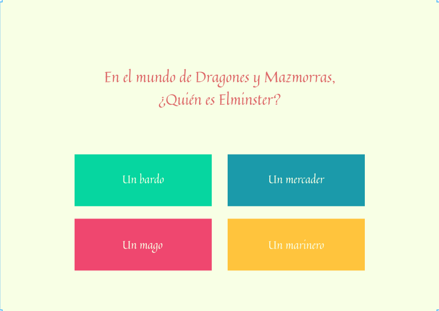

# Quiz #

## Introducción ##

Desarrollarás un juego de cuestionario, también conocido como Quiz, capaz de mostrar los resultados erróneos y correctos.


## Objetivos ##

Ser capaz de hacer tu primera aplicación con las 3 tecnologías aprendidas: HTML, CSS y Javascript.

## Requisitos ##

- HTML5

- CSS3

- Javascript

## Iteraciones ##


Te planteamos que, opcionalmente, crees un repositorio a partir de la plantilla [HTML5 Template](https://github.com/TheBridge-FullStackDeveloper/template-html5). Te ahorrará trabajo, y el propósito principal no es hacer una estructura de una página.

### HTML5 y CSS3 ###

-------------------------------------------------------------------------------

**Jueves**. Haremos toda la parte estética y estática del Quiz, a través de toda la funcionalidad posible que nos ofrezca HTML5 y CSS3.

#### HTML ####

`index.html`: Página de inicio y presentación, donde pondremos, al menos, un título y un enlace a `quiz.html`.

`quiz.html`: Esta página sólo albergará el formulario para el Quiz. Nada más.

- **El formulario:**

    El formulario estará compuesto de 5 preguntas, mínimo,  de la índole que se prefiera.

    Las opciones pueden ser únicas o múltiples, _radio_ o _checkbox._

    Es muy importante que el formulario esté correctamente construído:

    - No deben faltar etiquetas

    - El formulario debe llevar un atributo `name`, así como cada elemento de entrada de datos del formulario.

#### CSS ####

Al haber una página que sólo tiene un formulario con preguntas, tendrás que definir la altura del bloque de cada pregunta y sus respuestas como la altura del dispositivo donde se muestra.

1. El diseño de la aplicación será con un enfoque _"mobile first"_, por lo que comenzaremos realizando la maquetación sobre el diseño para móvil.



2. Aplicaremos nuestro primer punto de ruptura para el diseño de tablet, y aplicaremos las reglas propias de esta vista. Será a partir de 768px.



3. El tercero, y último punto de ruptura será para el escritorio. A partir de 1366px.

   Como pequeña ayuda, has de saber que el diseño es el mismo que para tablet.



### Javascript ###

-------------------------------------------------------------------------------

- **Viernes**. Validaremos el formulario a través de javascript al enviar. Aunque es posible hacerlo mediante CSS, no lo haremos. Es la semana de Javascript... y quedaría feo... :cry:

Si ayer "hiciste los deberes", tendrás un formulario que te será fácil validar las respuestas correctas.

1. Primero has de obtener todos los datos introducidos en el cuestionario. Ten en cuenta lo siguiente:

   1.1 Evitar que la página se refresque cuando pulsamos el botón de envío de formulario.

   1.2 Se han puesto restricciones para que todas las preguntas se deban responder obligatoriamente.

2. Crea un objeto cuya estructura pueda parecerse a esto:

    Si tenemos esto:

    ```javascript
    <form name="dnd">
        <fieldset>
          <legend>En el mundo de Dragones y Mazmorras, ¿Quién es Elminster?</legend>
          <label for="bard-field">Un bardo</label>
          <input id="bard-field" type="radio" name="elminster" value="bardo">

          <label for="merchant-field">Un mercader</label>
          <input id="merchant-field" type="radio" name="elminster" value="mercader">

          <label for="sorcerer-field">Un mago</label>
          <input id="sorcerer-field" type="radio" name="elminster" value="mago">

          <label for="sailor-field">Un marinero</label>
          <input id="sailor-field" type="radio" name="elminster" value="marinero">
        </fieldset>

        <button type="submit">Comprobar datos</button>
    </form>
    ```
    Sabemos que sólo hay una respuesta posible, por lo que nuestro objeto de respuestas podría ser así:

    ```javascript
    const respuestas = {
        elminster: "mago"
    }
    ```
    Tenemos la propiedad `name` como _clave_ del objeto y `value` como valor de dicha _clave_

3. Comprueba, comparando los valores del cuestionario enviado con tu objeto respuestas, mostrando por consola el resultado de cada comprobación.

4. Ahora sustituye imprimir el resultado de mostrar por consola cada comprobación por modificar el color del `input[type="radio"]` dependiendo del resultado:

    - Si una respuesta que obtenemos del formulario es igual la **_clave-valor_** a la que corresponde en el objeto de respuestas pintar de color verde el elemento marcado.

    - En caso contrario al anterior, pintar de color rojo.

_Premium_

¿Serías capaz de cambiar tu código para un formulario con 100 preguntas, 1000, o un "gritón"?


